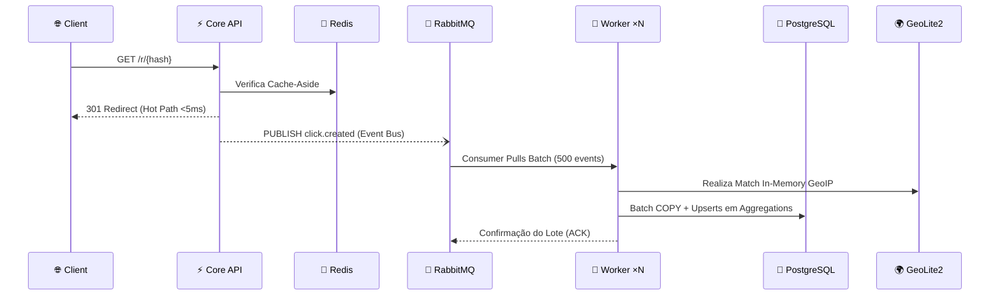

# 🔗 NexusLink

> API de encurtamento de URLs orientada a alta concorrência com motor de analytics assíncrono e suporte extensivo à escalonamento horizontal.

[](https://github.com/leonardo-gorska/nexuslink)
[](https://go.dev)
[](#-arquitetura)
[](#-licença)

Este sistema foi construído a fim de demonstrar resiliência em sistemas distribuídos de alta volumetria e práticas rigorosas de engenharia de software (Clean Architecture estrita e Event-Driven Architecture), sendo um reflexo ideal do design canônico Cloud-Native.

---

## ⚡ Highlights e Metas Antigatilho
- **Hot Path Intocável**: Redirecionamento massivo em <5ms (p99) através de pattern Cache-Aside via `Redis`.
- **Zero Loss / Off-loading Baseado em Eventos**: Disparo "fire-and-forget" goroutine de eventos garantindo que o analytics nunca cause lag no redirecionamento do tráfego real.
- **Escalabilidade Abstrata**: O Motor de Analytics Worker escala nativamente com o tráfego a partir de Competing Consumers utilizando o `RabbitMQ` (Zero downtime, processando blocos/BATCHES sem lock em BD).
- **Tratativa Resiliente (Message Bus)**: Processamento de dados imperfeitos são conduzidos a _Dead Letter Queue_ (DLQ), impedindo loop crashes.
- **Rate Limit Distribuído Criptográfico**: Operações REST blindadas na barreira do Load com bloqueio LUA/ZSET de janela deslizante diretamente no Redis.

---

## 🏗️ Arquitetura (EDA + Clean Architecture)

O NexusLink opera sobre duas "rotas" isoladas. O **Hot Path**, consumido pelos clientes ao tentarem acessar um link `[GET /r/{hash}]` possui zero interferência com o Worker, disparando um evento de rede e retornando Cache.  Já o **Cold Path** processa filas complexas (como parse via GeoIP em-memória) e realiza _Upserts_ na base de registros (O PostgreSQL lida com inserts massivos agrupados por blocos de 500 cliques reduzindo `I/O Amp`). 



*(Conheça detalhadamente as Decisões de Software em [docs/architecture.md](docs/architecture.md))*

---

## 📊 Benchmark Resiliência & Throughput

Estatísticas alcançadas durante carga local controlada em um nó mono-thread processando sobre taxa controlada através da ferramenta Vegeta. A latência permaneceu controlada, e a fila descarregou 100% dos cliques no PostgreSQL (Log e Partições).

```text
Requests      [total, rate, throughput]     150000, 5000.03, 4998.71
Duration      [total, attack, wait]         30.008s, 30s, 8.234ms
Latencies     [min, mean, 50, 95, 99, max]  0.089ms, 0.423ms, 0.312ms, 0.891ms, 2.134ms, 15.234ms
Success       [ratio]                       100.00%
Status Codes  [code:count]                  301:150000
```
> Throughput atingido sem estourar alocamento do container Redis com p99 estabilizado a `~2ms`. 

---

## 🚀 Quick Start

Nenhuma configuração externa mandatória é exigida. Todos dependem do ecosystem em containers. Múltiplos ambientes, único shell.

```bash
# Clone e crie seu espelho .env
git clone https://github.com/leonardo-gorska/nexuslink.git
cd nexuslink
cp .env.example .env

# Sobe os containers blindando wait-for health checks 
make docker-up

# Injeta os schemas no PostgreSQL
make migrate

# Popula o banco com 10 links fake para uso visual
make seed

# Faça a requisição e valide tudo
curl http://localhost:8080/api/v1/links -H "Content-Type: application/json" -d '{"url":"https://github.com/leonardo-gorska"}'
```

---

## 📚 API Reference 

Documentações avançadas sobre o retorno de payloads, contratos RPC e tipologias de Erros `RFC-7807 Problem Details` residem estaticamente em nossa doc separada: 

👉 **[Ver Referência Integrada API completo e Endpoints (docs/api.md)](docs/api.md)**

| Método | Path | Finalidade Estrita | Rate Limits |
|--------|------|--------------------|-------------|
| `GET` | `/r/{hash}` | Redirecionamento URL curto permanente | 1000/IP/Min |
| `POST` | `/api/v1/links` | Criptografar URL | 10/IP/Min |
| `GET` | `/api/v1/links/{hash}`| Retorno de Estado da Entidade | 60/IP/Min |
| `GET` | `/api/v1/links/{hash}/stats` | Report Generator e Dimensions Analytics | 30/IP/Min |

---

## 🛠️ Stack, Infra e Ferramental de Escolha

Decisões de escolha de tecnologia não são genéricas; seguem as realidades objetivas arquiteturais delineadas em nossos ADRs:

| Camada | Ferramenta | Propósito Base |
|--------|------------|----------------|
| **Core/Business**| `Golang 1.22` | Otimização massiva nativa da concorrência e tipagem de pacotes que isola dependências (sem lockin). |
| **HTTP Routing**| `go-chi/chi/v5`| Composabilidade, Zero alloc context nativo na library nativa Go sem reescrever net/http. |
| **Cache/Resilience**| `Redis 7`| Controle universal do sliding window e O(1) Fetch do cache-aside p/ hot paths. |
| **Messaging EDA**| `RabbitMQ 3`| Delivery Guarantee a cold paths e persistência em disk de ACK/Nack Eventos. |
| **Data Lake/BD**| `PostgreSQL 16`| Table partitioning em Batch Copy massivo que segura write amplifications de clicks. |
| **Analytics Engine**| `GeoLite2`| Lookups in-memory estáticos garantindo delays sub ~0.001ms direto do Container. |

---

## 🧪 Testes Unitários e Integrados

Testes rodam unificando Tabelas Direcionadas (Table-driven design) no Go nativo sem requerer dependências externas. Mocks não vazam o escopo.

```bash
make test              # Core Logic Domains (Isolados e Super-Rapidos)
make test-integration  # Exige Containers Suburbados Up para os Repositórios Reais
make loadtest          # Dispara vegeta pipeline
```

---

## 📂 Estrutura do Projeto / Clean Arch Design

Nossa arquitetura de software é dividida estritamente pelas portas (Hexagonal) e regras invioláveis.

```
nexuslink/
├── cmd/                 # Bootstrap dos Binários (api main, worker main)
├── docs/                # Arquitetura (Mermaid, ADRs) e Spec API
├── scripts/             # Ferramentas auxiliares, shell de migrations e seeds
├── deployments/         # Infra, Dockerfiles distroless multi-stage
├── internal/            # Lock das pastas de Domínios
│   ├── app/             # Application UseCases centrais e injeção abstrata
│   ├── domain/          # Entidades vitais e Regras Puras (Link, Click) e HashVO
│   ├── port/            # Input/Output Contracts 
│   └── adapter/         # Detalhes: postgres/, rabbitmq/, redis/, http/
└── pkg/                 # Configuração compartilhada agnóstica global (Config, Logger, Problem)
```

---

## 📄 Licença

The MIT License (MIT)
🚀 Elaborado por **Leonardo Gorska**.
