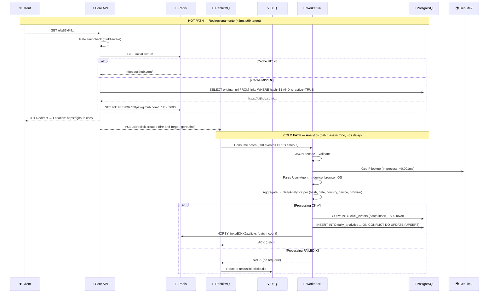
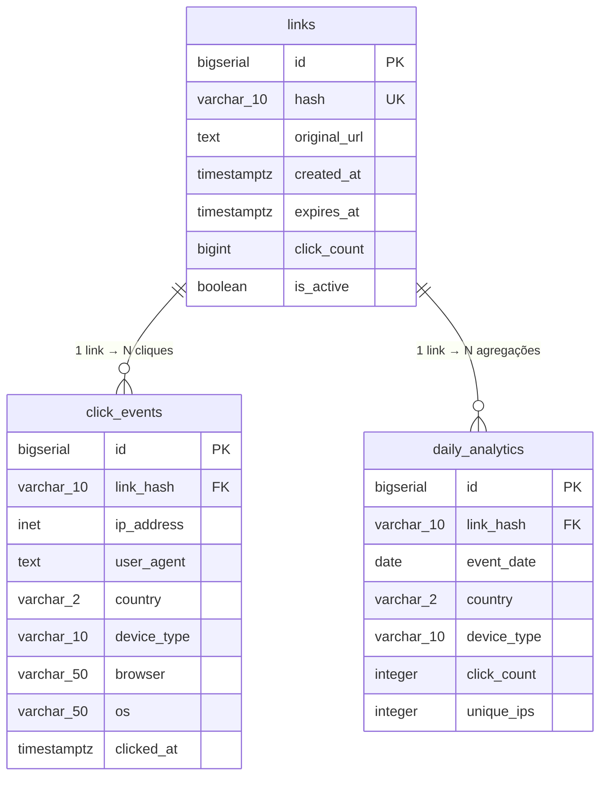

# NexusLink — Arquitetura e Decisões de Design (ADRs)

Este documento detalha a arquitetura do sistema NexusLink, incluindo a topologia de infraestrutura, os fluxos de eventos assíncronos e os registros de decisões arquiteturais. O NexusLink utiliza **Clean Architecture** aliada ao padrão **Event-Driven Architecture (EDA)** para garantir alta performance, baixo acoplamento e escalonamento horizontal suave.

---

## 1. Topologia de Alto Nível (C4 Container)

O sistema foi desenhado separando de forma rigorosa as operações **síncronas** de missão crítica (resolução e cache) das operações **assíncronas** intensivas em processamento (coleta de analytics e persistência).

```mermaid
graph TD
    User([Usuário])
    
    subgraph "API Layer (Stateless, Scale-out)"
        API[Core API / Gateway\nGolang]
    end
    
    subgraph "Cache & Rate Limit"
        Redis[(Redis\nIn-Memory Store)]
    end
    
    subgraph "Message Broker"
        RMQ[[RabbitMQ\nEvent Bus]]
        RMQ_DLX[[DLX / DLQ\nDead Letters]]
    end
    
    subgraph "Analytics Engine"
        Worker1[Worker 1\nGolang]
        Worker2[Worker 2\nGolang]
        WorkerN[Worker N\nGolang]
    end
    
    subgraph "Persistence"
        PG[(PostgreSQL\nRDBMS)]
    end
    
    User -->|GET /r/{hash}| API
    API -->|1. Check Cache / Rate Limit| Redis
    API -->|2. Fallback Lookups| PG
    API -->|3. Publish Event| RMQ
    RMQ -->|Consume Batch| Worker1 & Worker2 & WorkerN
    RMQ_DLX -.->|Failed Events| RMQ
    Worker1 & Worker2 & WorkerN -->|Batch/Upsert| PG
```

### Estratégia de Escalonamento
- **API**: Pode ser replicada (Múltiplas instâncias atrás de um Load Balancer / Ingress). Por não possuir estado local (stateless), o scaling é imediato.
- **Worker**: Projetado utilizando o padrão de *Competing Consumers*. Múltiplos workers consomem da mesma fila. Escalonam com a entrada massiva de eventos.
- **Redis & PostgreSQL**: O Redis mitiga picos e absorve 90%+ das requisições de leitura. PostgreSQL foi particionado em tabelas mensais para não gargalar nas escritas do fluxo de log bruto.

---

## 2. Fluxo de Execução (Hot Path vs Cold Path)

A distinção fundamental na API é lidar com os redirect handlers (onde precisamos focar em submilissegundos) isoladamente do processamento do Analytics.



### Contrato de RabbitMQ (Event Messaging)
- **Topologia**: Exchange `nexuslink.events` (Topic) → Routing `click.created` → Queue `nexuslink.clicks`.
- **Dead Letter Queue (DLQ)**: Qualquer mensagem que venha a sofrer *Nack* no Worker será desviada para a queue `nexuslink.clicks.dlq`.
- O payload carrega um UUID v4 no `event_id` provendo idempotência, versionamento (Schema Evolution) e `request_id` originário.

---

## 3. Modelo de Dados Relacional (ERD)

A base possui estratégias pesadas de agregação. Guardamos o registro do clique bruto na tabela `click_events` (que sofre table-partitioning por mês para remoção simples por DROP PARTITION - O(1)), além de criar visualizações agregadas contínuas via Upsert na `daily_analytics` - preenchida por lotes através dos Workers.



---

## 4. Architecture Decision Records (ADRs)

Documentação sintética das escolhas de design ao longo do projeto.

| ID | Nome | Decisão Executada | Justificativa |
|-------|-------|-----------------|---------------|
| **ADR-001** | Linguagem Principal | Empregar Golang (Go 1.22) | Maior performance por concorrência. Menor uso RAM/CPU comparado à JVM. Idiomática com infraestrutura cloud-native moderna (o que ressoa em ambientes de alta criticidade). |
| **ADR-002** | Algoritmo de Hashing | Geração de strings de 7 chars (Base62) via lógica interna e validação de `crypto/rand` com retentativas (Max 3 colisions retries). | Possibilita 3.5 trilhões de colisões únicas permitindo URLs limpas, evitando NanoID third party e lidando melhor nas query bases limitando conflitos. |
| **ADR-003** | GeoIP Analytics | O banco de dados MaxMind GeoLite2 Lite será embarcado estaticamente. Lookup ocorre via `in-process`. | Executar REST pings (como para ip-api) arruinaria nossa volumetria. Trazendo in-memory o DB garante lookups de ~0.001ms. |
| **ADR-004** | Frame de Rotas Web | Chi Router (`go-chi/chi/v5`) | Escolhido devido à aderência nativa as interfaces do stdlib `<http.HandlerFunc>`, promovendo middleware tracking universal e não criando "vendor lockin". |
| **ADR-005** | Batch Insert Worker | COPY protocol in PostgreSQL | Utiliza o `pgx.CopyFrom` na library PGX. É matematicamente cerca de 100x mais veloz inserir 500 registros numa batelada otimizada via COPY do que realizar 500 chamadas INSERT separadas. |
| **ADR-006** | Particionamento Declarativo | A tabela de cliques no BD cria ranges separados por mês | Logs diários contínuos farão a tabela atingir tamanhos ineficientes. O planner processa muito mais rapidamente dados de partições menores, facilitando também drop rápido e VACUUM focado. |

---

## 5. Implementação Clean Architecture "by the book"

O diretório principal sob o paradigma estrito de Ports & Adapters:

- **`internal/domain` (Camada 1):** Essência isolada das structs puras `Link` e `ClickEvent`. Tratamento primitivo (`ErrLinkNotFound`). Zero dependência de frameworks.
- **`internal/port` (Camada 2):** Declara as Portas abstratas (interfaces HTTP Inputs e Database Outputs). A ponte purificada pro mundo exterior.
- **`internal/app` (Camada 3):** Aplicação de core functions. Central de Casos de uso como `link_service` (LinkUseCase) e o poderoso agregador do Worker no `analytics_service`.
- **`internal/adapter` (Camada 4):** O meio externo - adaptadores baseados em PostgreSQL (`pgx`), Redis (`go-redis/v9`), RabbitMQ (`amqp091-go`) e Handlers Web (Chi API + prometheus exporter).
